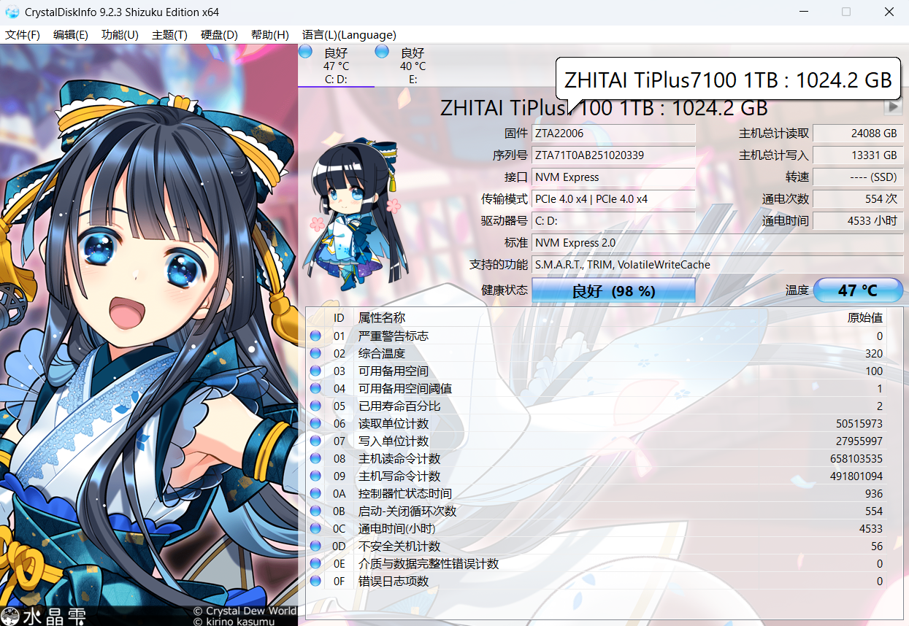

# 查看磁盘健康状态

硬盘是电脑中存储数据的关键部件，硬盘故障可能导致数据丢失。定期检查硬盘健康状态，可以在故障发生前提前预警，及时备份数据。

## 使用 CrystalDiskInfo

[CrystalDiskInfo](https://crystalmark.info/en/software/crystaldiskinfo/) 是一款免费的硬盘健康状态检测工具，通过读取硬盘的 S.M.A.R.T. 自我监测数据，判断硬盘当前的健康状况。

图吧工具箱中已内置 CrystalDiskInfo（在磁盘工具列表中名为 **DiskInfo**），可以直接使用，无需单独下载。关于图吧工具箱的介绍与下载，请参考[常用工具推荐](../Software/Recommended.md#图吧工具箱)。

### 操作步骤

1. 打开图吧工具箱，切换到左侧的**磁盘工具**分类
2. 双击 **DiskInfo（64位）** 启动 CrystalDiskInfo
3. 软件会自动识别所有硬盘，在顶部可以切换不同的硬盘

### 如何判断硬盘健康状态

#### 健康状态指示

软件最显眼的位置会显示硬盘的健康状态，分为三种：

| 状态             | 含义                             | 建议                       |
| ---------------- | -------------------------------- | -------------------------- |
| **良好（蓝色）** | 硬盘工作正常，没有异常指标       | 无需处理，定期关注即可     |
| **警告（黄色）** | 存在异常指标，但尚未达到危险阈值 | 尽快备份重要数据，考虑更换 |
| **不良（红色）** | 硬盘已出现严重问题               | 立即备份数据，尽快更换硬盘 |

#### 关键指标解读

S.M.A.R.T. 属性列表中有几项特别值得关注：

| 属性名称                    | 含义                       | 需要关注的情况                                  |
| --------------------------- | -------------------------- | ----------------------------------------------- |
| 01 严重警告标志             | 硬盘严重错误的综合标志     | 值不为 0 说明硬盘已有严重问题，建议立即备份数据 |
| 03 可用备用空间             | SSD 用于替换坏块的备用空间 | 数值越低，SSD 寿命越接近极限                    |
| 05 已用寿命百分比           | SSD 已消耗的寿命           | 接近 100% 说明 SSD 即将耗尽寿命，建议尽快更换   |
| 0D 不安全关机计数           | 非正常断电的次数           | 频繁增加说明存在异常断电问题，避免直接拔电源    |
| 0E 介质与数据完整性错误计数 | 数据读写出错次数           | 持续增长说明存储介质可能损坏                    |

> [!NOTE]
> 部分指标为 NVME SSD 专属，机械硬盘不显示"可用备用空间"、"介质与数据完整性错误计数"和"已用寿命百分比"，SATA 固态硬盘的指标也不同，这是正常现象
> 05 寿命指标是基于厂家提供的寿命计算公式得到，和保修情况有关，可能与实际不符，特别是铠侠硬盘，尽管寿命已经降到 0 但是仍然能使用很长一段时间，请根据实际情况判断

### 多久检查一次

- 日常使用：每 3-6 个月检查一次即可
- 电脑频繁蓝屏/卡顿时：立即检查
- 硬盘使用超过 3 年：建议每 1-2 个月检查一次
