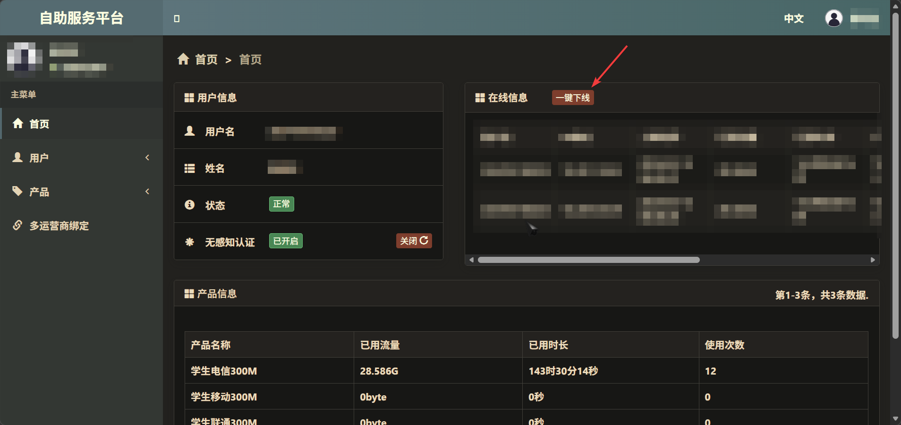

# 正常登录

首先连接`ZAFU`校园网。如果自行准备路由器，请确保路由器连接在通网的网口上，连接上路由器的WLAN，如有问题可以在智慧浙农林进行网络报修询问情况

访问[校园网登录链接](http://10.152.250.2/)。确保正确填写账号和密码，**并选择正确的服务商**。

如果一切正常将连接校园网

# 自助服务

在认证成功后会出现自助服务链接，或者可以在校园网内直接访问[链接](https://zfw.zafu.edu.cn/home)

可以自助下线设备、配置MAC Auth等

# 常见问题

## 无法访问

请确保正确连接校园网

## 无法认证

请检查校园卡是否欠费

## 认证后无法正常上网

如果有设备可以访问校园网，访问[自助服务](https://zfw.zafu.edu.cn/home)，手动下线所有设备后再试

## 其他问题

可以在智慧浙农林进行网络报修询问情况，或者前往电脑医院值班室询问
