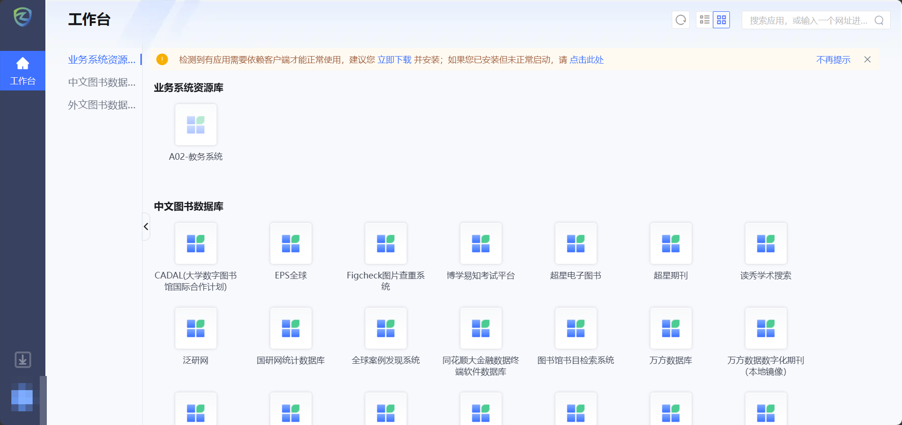
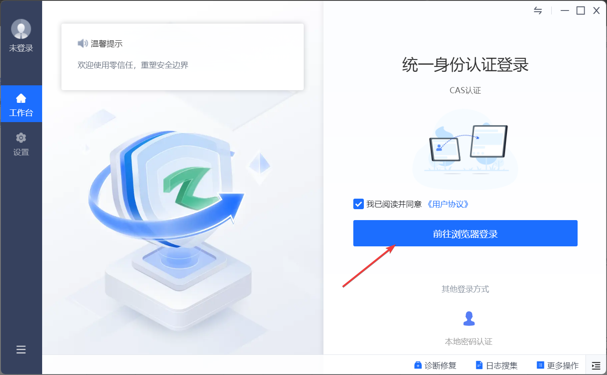
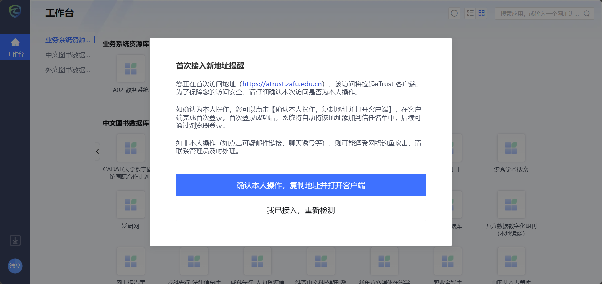

# 校外访问资源（零信任访问控制系统）

## 概述

学校已部署**零信任访问控制系统**（ZTNA，即深信服 aTrust），用于替代传统的 VPN 及 webVPN 系统。该系统的核心安全理念是：**默认不信任网络内外的任何实体**，在每次访问请求中进行严格的身份验证，从而保护学校资源安全。

> [!NOTE]
> 零信任访问控制系统**仅限校外网络环境**使用。在校内直接连接校园网即可访问校内资源，无需使用本系统。

## 关键时间节点

| 阶段     | 时间                                    | 说明                                                      |
| -------- | --------------------------------------- | --------------------------------------------------------- |
| 试运行期 | 2025 年 11 月 15 日 — 2026 年 1 月 1 日 | 零信任系统与 VPN 系统并行运行，期间请完成客户端安装与登录 |
| 正式切换 | 2026 年 1 月 1 日 23:00 起              | 传统 VPN 系统停用，所有校外访问统一通过零信任系统进行     |

> [!IMPORTANT]
> 2026 年 1 月 1 日 23:00 起，传统 VPN 系统将正式停用，其浏览器客户端将无法再打开和成功连接。请在此之前完成零信任客户端的安装与登录。

> [!NOTE]
> 下载安装包时请勿使用多线程下载器，使用多线程下载会被限流，使用浏览器自带下载器即可

## 客户端下载与安装

### 下载客户端

1. 使用浏览器访问专属下载地址：[https://atrust.zafu.edu.cn/portal/#/down_client_new](https://atrust.zafu.edu.cn/portal/#/down_client_new)
2. 根据电脑操作系统选择对应版本下载
3. 下载完记得安装

## 登录与使用

### 方式一：浏览器登录（WebVPN 方式）

> [!IMPORTANT]
> 此方式无需安装客户端，仅适用于已完成与零信任系统对接的信息系统。
> 教务系统只支持使用客户端访问！

1. 在浏览器中访问 [https://atrust.zafu.edu.cn](https://atrust.zafu.edu.cn)
2. 使用学校**统一身份认证**用户名和密码登录
3. 登录成功后，操作方式与原 webVPN 系统一致

### 方式二：客户端登录

1. 打开已安装的 aTrust 客户端
2. 点击**前往浏览器登录**，浏览器将自动打开统一身份认证页面
   
   
3. 使用学校统一身份认证账号（学号或工号）和密码登录
4. 登录成功后，工作台会显示所有可使用的资源，选择需要的资源即可访问
5. 使用完毕后，点击左下角图标**退出客户端**，释放资源

> [!TIP]
> Windows 系统中，aTrust 运行时会在底部任务栏右下角显示图标，双击该图标可打开工作台或退出客户端。

> [!IMPORTANT]
> aTrust 会建立虚拟网卡以进行加密通信，和 Npcap、Easytier 等虚拟网卡冲突，使用时请关闭所有系统代理和卸载其他虚拟网卡
> 如果有其他问题请使用"诊断修复"，根据提示解决

### 登录账号说明

| 登录方式     | 账号       | 密码                                        | 适用场景                         |
| ------------ | ---------- | ------------------------------------------- | -------------------------------- |
| 统一身份认证 | 学号或工号 | 与学校统一身份认证一致（与原 VPN 系统一致） | 师生公共访问的信息系统及图书资源 |
| 网络设备运维 | 运维账号   | 与原 VPN 设备一致                           | 校内服务器等网络设备运维         |

> [!WARNING]
> 网络设备运维用户**首次登录后请立即更改密码**。

## 常见问题

### 浏览器无法拉起客户端

访问 aTrust 门户后，浏览器提示需要下载安装客户端，但实际已安装。

**解决方法：**

1. 确认浏览器版本（Chrome ≥ 142 或 Edge 新版受影响）
2. 在浏览器地址栏左侧点击网站图标，进入**网站设置**
3. 将**本地网络访问权限**改为**允许**
4. 关闭浏览器后重新登录

#### Chrome 浏览器设置

1. 点击右上角三个点 → **设置**
2. 依次选择 **隐私与安全** → **网站设置**
3. 向下滚动找到 **本地网络访问权限**
4. 默认行为选择**网站可以请求连接到本地网络上的任何设备**
5. 检查学校网址是否出现在**不允许连接**列表中，如有则删除

#### Edge 浏览器设置

1. 点击右上角三个点 → **设置**
2. 依次选择 **隐私、搜索和服务** → **站点权限** → **所有权限**
3. 找到并点击 **本地网络访问**
4. 确保学校网址未出现在**不允许连接**列表中

### 连接失败

客户端提示"连接失败"。

**解决方法一：检查更新**

1. 点击客户端中的**设置**
2. 点击**检查更新**，如有更新则下载安装最新版本

**解决方法二：关闭 IPv6**

1. 打开**控制面板** → **网络和 Internet** → **网络和共享中心**
2. 点击左侧 **更改适配器设置**
3. 右键当前使用的网络连接，选择**属性**
4. 取消勾选 **Internet 协议版本 6（TCP/IPv6）**
5. 点击**确定**

### 登录后无法访问资源

- 请确认是否在校外网络环境下使用（校内无需使用本系统）
- 检查账号是否有对应资源的访问权限
- 尝试退出客户端后重新登录

### 客户端被杀毒软件拦截

- 将 `aTrustTray.exe` 添加到杀毒软件白名单中
- 重新登录门户，点击"启动客户端"即可正常拉起

## 其他说明

- 原有 VPN 系统的用户名、密码与零信任系统**完全一致**，无需重新注册
- 使用过程中若有问题，请联系信息中心
    - 联系人：姜老师
    - 联系电话：63741937（9291937）

> [!NOTE]
> 如需了解更多零信任访问控制系统的功能与特性，可参考 [深信服 aTrust 官方介绍](https://www.sangfor.com.cn/sangfor-security/atrust)。
